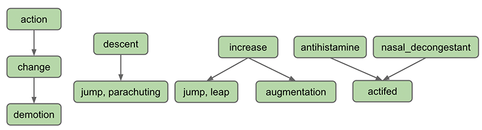

~ number: 1
~ title: NGordNet

As this is a totally new project, there may be occasional bugs. Please contact Josh directly with any anomalies that you observe: hug@cs.berkeley.edu.

In this project, we will explore how the volume of printed works in English has changed over time, as well as the structure of the is-a relationships of words in English.

Key things we'll investigate:

 - The relative popularity of words over time.
 - The relative popularity of categories of words over time.
 - The hypnoyms (see below) of a given word.
 - The length of words.
 - Zipf's law.

To support these investigations, you will write a new package almost from scratch called Ngordnet that contains the following classes:

    public class WordNet
    public class TimeSeries<T extends Number> extends TreeMap<Integer, T>
    public class YearlyRecord
    public class NGramMap
    public class WordLengthProcessor implements YearlyRecordProcessor
    public class Plotter
    public class NgordnetUI
    Test classes for the classes above.
    Any additional public classes you'd like.

Along the way we'll get lots of experience with different useful data structures. The full technical specification for the ngordnet package can be found [here](https://berkeley-cs61b.github.io/public_html/materials/proj/proj1/javadocs/index.html). Below follows a description of each class. You can go in any order you choose, but we recommend that you work through the project in the order given in this document.

To get started, use the ever fun to type ```git pull skeleton master```. You'll also need to download the project 1 datafiles (not provided via github for space reasons). You can find them [at this link](http://www.cs.berkeley.edu/~hug/p1data.zip). You should unzip these into the proj1 directory. Note that we've set up hidden [.gitignore](https://help.github.com/articles/ignoring-files/) files in the skeleton code so that git will avoid uploading these data files. This is intentional. Uploading these files to github will result in a lot of headaches for everybody, so please don't mess with the .gitignore files. If you need to work on multiple machines, you should download the zip file once for each machine.

Part of the grade for this project will include following the [course style guidelines](http://berkeley-cs61b.github.io/public_html/materials/guides/style-guide.html). As noted, you should not try to read these rules, though they may be a useful reference. It will be much easier to simply run the style checker. You can do this by running the style61b.py script provided in the lib folder (you may need to pull from skeleton again if you don't see it). For example, on my machine, I can run it as follows.

    $ python /Users/jug/work/61b/course-materials/lib/style61b.py *.java

There are no secret tests for the style checker, though we reserve the right to grade you holistically on your overall code composition. We will only style check the required .java files, i.e. those in the MethodSignatures file / javadocs.

Similarly, time permitting, we will be allocating a small portion of your grade to the thoroughness of your JUnit tests. We hope that we've convinced you that tests are easy to write and can save you a ton of time if done properly. 

**While reading this spec, don't start coding until we tell you to. If you jump in early, you're likely to go down the wrong path. The spec and supporting files should be your first source of information and you should consult this document before seeking outside help.**

3/5/2015: The only restriction on the libraries you use is that it runs on the autograder. You should not assume that we have Guava or Apache Commons or similar installed. It is OK to include .java files from these libraries, provided that you cite your sources.

1: The WordNet Class
=====

Your ultimate goal in building the WordNet class is to read input files and store them in ADTs of your choice that allow for rapid queries. Before you write the WordNet class, it'll be important that you understand the nature of the WordNet dataset and the structure of the files representing it. 

[WordNet](http://en.wikipedia.org/wiki/WordNet) is a semantic lexicon for the English language that is used extensively by computational linguists and cognitive scientists; for example, it was a key component in IBM's Watson. WordNet groups words into sets of synonyms called synsets and describes semantic relationships between them. One such relationship is the is-a relationship, which connects a hyponym (more specific synset) to a hypernym (more general synset). For example, "change" is a **hypernym** of "demotion", since "demotion" is-a (type of) "change". "change" is in turn a **hyponym** of "action", since "change" is-a (type of) "action". A visual depiction of some hyponym relationships in English is given below:



Synsets consist of one or more words in English that all have the same meaning. For example, one synset is ["jump, parachuting"](http://wordnetweb.princeton.edu/perl/webwn?o2=&o0=1&o8=1&o1=1&o7=&o5=&o9=&o6=&o3=&o4=&s=jump&i=6&h=000010000000000000000000#c), which represents the act of descending to the ground with a parachute. "jump, parachuting" is a hyponym of "descent", since "jump, parachuting" is-a "descent". 

Words in English may belong to multiple synsets. This is just another way of saying words may have multiple meanings. For example, the word jump also belongs to the synset ["jump, leap"](http://wordnetweb.princeton.edu/perl/webwn?o2=&o0=1&o8=1&o1=1&o7=&o5=&o9=&o6=&o3=&o4=&s=jump&i=2&h=100000000000000000000000#c), which represents the more figurative notion of jumping (e.g. a jump in attendance). The hypernym of the synset "jump, leap" is "increase", since "jump, leap" is-an "increase".  Of course, there are other ways to "increase" something, for example, through "augmentation," and thus it is no surprise that we have an arrow pointing downwards from "increase" to "augmentation" in the diagram above.

Synsets may include not just words, but also what are known as [collocations](http://en.wikipedia.org/wiki/Collocation). You can think of these as single words that occur next to each other so often that they are considered a single word, e.g. [nasal_decongestant](http://wordnetweb.princeton.edu/perl/webwn?s=nasal+decongestant+&sub=Search+WordNet&o2=&o0=1&o8=1&o1=1&o7=&o5=&o9=&o6=&o3=&o4=&h=). To avoid ambiguity, we will represent the constitutent words of collocations as being separated with an underscore \_ instead of the usual convention in English of separating them with spaces. For simplicity, we will refer to collocations as simply "words" throughout this document. 

A synset may be a hyponym of multiple synsets. For example, "actifed" is a hyponym of both "antihistamine" and "nasal\_decongestant", since "actifed" is both of these things.

If you're curious, you can browse the Wordnet database by [using the web interface](http://wordnetweb.princeton.edu/perl/webwn?o2=&o0=1&o8=1&o1=1&o7=&o5=&o9=&o6=&o3=&o4=&r=1&s=sturgeon&i=3&h=1000#c), though this is not necessary for this project.

The WordNet digraph 
-----------

To store the WordNet dataset, you'll need to use at least two data structures. One of these will be a data structure we haven't discussed in class yet called a Digraph (short for Directed Graph). 

A small subgraph of the WordNet Digraph is illustrated below. In our copy of the dataset (and in the graph below), words that belong to the same synset are separated by spaces (not commas as in the figure above), and collocations use underscores instead of spaces (e.g. "car\_pool" instead of "car pool", same as the figure above). 


A graph consists of a set of V vertices and E edges (represented by arrows in the above figure) between vertices. For example, in the graph above, V = 23 and E = 23. One of these edges is from "increase" to "jump leap", indicating that the synset "increase" is a hypernym of "jump leap". 

Your first task in this assignment is to read in the provided synset and hyponym datafiles (see further down on this page for the structure of the synset and hyponym files). To represent the arrows, we'll be using a class from the ```edu.princeton.cs.algs4``` package called Digraph (which you can import with ```edu.princeton.cs.algs4.Digraph```. You can think of this class as having only a constructor and an addEdge method (it actually has more, but you won't be using them directly, as you'll instead be relying on a provided GraphHelper class, described further below):

    public class Digraph() {
        /** Creates a new Digraph with V vertices. */
        public Digraph(int V)

        /** Adds an edge between vertex v and w. */
        public void addEdge(int v, int w)
    }

Note that the Digraph class requires us to know the number of vertices in advance, and only allows us to add edges based on a vertex number, e.g. the following desirable code wouldn't work:

    Digraph g = new Digraph(100);
     // Code below is invalid. addEdge accepts only ints.
    g.addEdge("dash sprint", "run running");
    g.addEdge("locomotion travel", "motion movement move");

This might seem like an annoying limitation of our Digraph class. However, even if the Digraph class allowed such convenient syntax, it wouldn't work for WordNet, because there can be multiple Synsets that have the exact same String. For example there are two synsets represented by exactly the String ["American"](http://wordnetweb.princeton.edu/perl/webwn?s=American&sub=Search+WordNet&o2=&o0=1&o8=1&o1=1&o7=&o5=&o9=&o6=&o3=&o4=&h=0), each with their own hypernyms. 

To avoid this ambiguity, the synsets and hyponyms files have a special structure, described in the next section.

The WordNet input file formats.
------
We now describe the two data files that you will use to create the wordnet digraph. The files are in CSV (comma separated value) format: each line contains a sequence of fields, separated by commas.

 - List of noun synsets. The file synsets.txt (and other smaller files with synset in the name) lists all the (noun) synsets in WordNet. The first field is the synset id (an integer), the second field is the synonym set (or synset), and the third field is its dictionary definition (or gloss). For example, the line

        36,AND_circuit AND_gate,a circuit in a computer that fires only when all of its inputs fire

    means that the synset ```{ AND_circuit, AND_gate }``` has an id number of 36 and its definition is "a circuit in a computer that fires only when all of its inputs fire". The individual nouns that comprise a synset are separated by spaces (and a synset element is not permitted to contain a space). The S synset ids are numbered 0 through S − 1; the id numbers will appear consecutively in the synset file. You will not (officially) use the definitions in this project, though you're welcome to create public subclasses of WordNet that do use them in some interesting way.

  - List of hyponyms. The file hyponyms.txt (and other smaller files with hyponym in the name) contains the hyponym relationships: The first field is a synset id; subsequent fields are the id numbers of the synset's direct hyponyms. For example, the following line

        79537,38611,9007

    means that the the synset 79537 ("viceroy vicereine") has two hyponyms: 38611 ("exarch") and 9007 ("Khedive"), representing that exarchs and Khedives are both types of viceroys (or vicereine). The synsets are obtained from the corresponding lines in the file synsets.txt:

        79537,viceroy vicereine,governor of a country or province who rules...
        38611,exarch,a viceroy who governed a large province in the Roman Empire
        9007,Khedive,one of the Turkish viceroys who ruled Egypt between...

Tips on Developing the WordNet Class
--------

Check out WordNetDemo.java in the demos folder. This provides examples of how the WordNet class should behave. Naturally it won't compile or run since you haven't written WordNet, but you should make sure to understand the expected behavior of this demo class before doing anything else. You're welcome to adapt the example calls from this file into JUnit tests, though such tests will not be sufficient to guarantee proper function.

Once you've checked out the demo, you'll want to pick the ADTs that you want to use to support the desired operations. This will be somewhat similar to what you did in the week 6 discussion, namely using somewhat unfamiliar ADTs to solve a real world problem. It wouldn't be a bad idea to [review the week 6 discussion worksheet before proceeding](http://berkeley-cs61b.github.io/public_html/materials/discussion/discussion6.pdf).

You're allowed to discuss designs with other students, **but we request that you do not post exact instance variable declarations on Piazza (e.g. if you decide you want to use a `List<TreeSet<Integer>>`, please don't post this variable declaration on Piazza)**. We want everyone to give this some real thought. Despite these admonitions, sharing ideas (or even instance variables) will not be considered plagiarism. As always, cite any help that you receive from others.

To see the exact API that you must follow for WordNet, see the [WordNet javadocs](javadocs/index.html?ngordnet/WordNet.html). Make sure to take advantage of the MethodSignatures file provided with the skeleton. **You may not add additional public or protected methods to WordNet.java or any other required files in this project. You may add additional package protected or private methods as you please. You may add additional public classes (with public methods).** There are no restrictions on the libraries that you use. Note that if you want to use something from the Princeton Standard library, you'll need to import it (since your Ngordnet code is not part of the anonymous package). You can import `In`, for example, using `import edu.princeton.cs.introcs.In;`.

See the demos/GraphDemo.java file for an example using the Digraph class. The GraphHelper class provides a descendants method that finds all descendants of a given item in a graph. You are not required to use GraphHelper. In fact, you are not required to use the Digraph class.

Almost all of the work is going to be in the constructor. It is very easy to go down the wrong path while writing the constructor. You should not be afraid to scrap your work if your original design does not work out. Before you even begin writing your constructor, we suggest writing out what your ADTs should look like after reading in the files ```synsets11.txt``` and ```hyponyms11.txt```. You might also consider what methods of these ADTs you'll need to call in order to support the isNoun() and hyponyms() methods.

Your initial tests should use the small data files `synsets11.txt` and `hyponyms11.txt`. Make sure your code works on these files before moving on to the full dataset, as the large files are hard to read through manually and take relatively long to load.

When you're done, you'll be able to programatically ask for the hyponyms of a word. For example, if you use `synsets.txt` and `hyponyms.txt`, hyponyms("animal") should return a huge set including: ankylosaurus, dinosaur, tenpounder, porcupine, chinchilla, bufflehead, adjutant, blindworm, nightwalker, mutant, ... 

2: Intro to the NGrams Dataset
=====

The [Google Ngram dataset](http://storage.googleapis.com/books/ngrams/books/datasetsv2.html) provides many terabytes of information about the historical frequencies of all observed words and phrases in English (or more precisely all observed [kgrams](http://en.wikipedia.org/wiki/N-gram)). Google provides the Google Ngram Viewer on the web, allowing users to visualize the relative historical popularity of words and phrases.

Our next task will be to allow for the visualization of this historical data on our own terms. Ultimately, we'll combine this dataset with the WordNet dataset to be able to ask new and interesting questions that I don't think have ever been asked before this assignment was created (cool!). 

Over the weekend, I'll be releasing an overview video, as well as [project 1 slides](https://docs.google.com/presentation/d/1KqBKvX6ZOp-8lvKcrE-wTg7_7ZFeeu9cGtH_SHtL4qg/pub?start=false&loop=false&delayms=3000) that provide a top-down view of the Ngordnet system. The written spec below should be sufficient to complete the spec, so don't wait if you're eager to continue.

3: TimeSeries
=====

**Do not start this part of the project until you have completed HW5 and also have a good grasp of the methods developed in the Generics lecture. I strongly recommend doing the [lecture 14 hardMode exercise](https://github.com/Berkeley-CS61B/lectureCode/blob/master/lec14/exercises/hardMode/readme.md) before beginning this part of the project.** The lec14 hardMode exercise touches on the same tricky syntax as we'll see in this part of the project, but you'll have access to the answers (see the live1 and live2 folders).

In HW5, we built some basic collections from scratch. Now we'll build a more sophisticated datatype known as a TimeSeries. A TimeSeries will be a special purpose extension of the existing TreeMap class where the key type parameter is always Integer, and the value type parameter is something that extends Number. Each key will correspond to a year, and each value a numerical data point for that year.

For example, the following code would create a `TimeSeries<Double>` and associate the number 3.6 with 1992 and 9.2 with 1993.

        TimeSeries<Double> ts = new TimeSeries<Double>();
        ts.put(1992, 3.6);
        ts.put(1993, 9.2);

The TimeSeries class will also provide additional utility methods:

 - years(): Returns all years as a `Collection<Number>`
 - data(): Returns all data as a `Collection<Number>`
 - plus(TimeSeries x): Returns the yearwise sum of x and this.
 - dividedBy(TimeSeries x): Returns the yearwise quotient of this and x.

Our ultimate goal is to make usage of the xChart plotting library easy. Since xChart expects data in `Collection<Number>` form, it is natural for our TimeSeries class to provide utility methods to generate such Collections.

As throughout this assignment, the MethodSignatures file provided in the skeleton gives the exact class definition and signatures that you'll need. Likewise, see the TimeSeriesDemo class for a more thorough example of the behavior of the class. See the [TimeSeries javadocs](javadocs/index.html?ngordnet/TimeSeries.html) for a more detailed technical specification of your class.

As with everything in this assignment you should not create additional public or protected methods. Additional public classes are fine. It is OK to override existing public methods (e.g. equals). 

Warning: It is very easy to run into issues with generics. Compile frequently. Do not dare write more than one of these methods at a time.

Hint (3/6/2015): You should not add any instance variables to your TimeSeries class. They are unnecessary.

4: YearlyRecord
=====

**Before beginning this class, you should [review problem 3a on the week 6 discussion worksheet](http://berkeley-cs61b.github.io/public_html/materials/discussion/discussion6.pdf). Make sure you know how to solve problem 3a before attemping to design your YearlyRecord implementation.**

While the TimeSeries type will be handy for representing historical data, we will sometimes want to consider the data regarding all words for an entire year. 

For example, the following code would create a YearlyRecord and record that the word "quayside" appeared 95 times, the word "surrogate" appeared 340 times, and the word "merchantman" appeared 181 times. 

        YearlyRecord yr = new YearlyRecord();
        yr.put("quayside", 95);        
        yr.put("surrogate", 340);
        yr.put("merchantman", 181);    

The YearlyRecord class will also provide utility methods to make data analysis and plotting easier:

 - count(String word): Returns the count of word in this year.
 - size(): Returns the number of words recorded this year.
 - words(): Returns all words in ascending order of count.
 - counts(): Returns all counts in ascending order of count.
 - rank(String word): Gives the rank of word, with 1 being the most popular word. If two words have the same rank, break ties arbitrarily. No two words should have the same rank.

Revised (friendlier) performance requirements (2/28/2015): This one will be a bit more involved than TimeSeries. The rank, size, and count methods should all be very fast, no matter how many words are in the database. Specifically, on a "frozen" YearlyRecord, their runtime should be about the same on average no matter how large the YearlyRecord, where a frozen YearlyRecord is defined as one for which no additional put operations occur. That means that typical calls to these methods cannot use looping, recursion, sorting, or similar. However, it is OK if one or more of these techniques is used rarely. See <a href="https://docs.google.com/presentation/d/1KqBKvX6ZOp-8lvKcrE-wTg7_7ZFeeu9cGtH_SHtL4qg/edit#slide=id.g7be664e68_15117">this example</a> for more.

You can achieve this through judicious use of the right data structures. You may assume that the get methods of a map take about the same time no matter how large the map. You may not assume this about the get methods of lists. 

Revised (stricter) performance revision (3/3/2015): For 0.1 points of extra credit, your put method should be fast no matter how large the datafiles. This will also make the plotting part of the assignment more interesting since you'll be able to read all\_words.csv.

**See the provided YearlyRecordTimeTest.java.freetest file for a timing test.** You'll need to rename this file to have a .java extension before it can be compiled.

See the [YearlyRecord javadocs](javadocs/index.html?ngordnet/YearlyRecord.html) for a more precise technical specification, and YearlyRecordDemo for additional examples showing typical use.

New note (3/6/2015): If you end up going down a blackhole of bad performance and you're pretty sure you've hit a dead end, don't be afraid to scrap your design and redo it from scratch. It might feel like you're redoing everything, but most of the work is in building a mental model of what your code should be doing, and the actual programming part shouldn't be so bad (except when learning new syntax).

**The basics autograder will cover up through this point in the project. Your project 1 bonus point will depend on how many AG tests you have completed by March 6th at 11:59 PM. It is intended as a basic sanity check only, and will not be a thorough test.** The submit autograder will run on the evenings of March 7th, 8th, 9th, 10th, and 11th.

5: NGramMap
=====

The [NGramMap (javadocs)](javadocs/index.html?ngordnet/NGramMap.html) type will provide various convenient methods for interacting with Google's NGrams dataset. 

Most significantly, the NGramMap class will provides methods to look up a TimeSeries for a given word or the YearlyRecord for a given year. For example, we might request the relative popularity of the word "fish" since the year 1850 until 1933, as shown below:

    NGramMap ngm = new NGramMap("./ngrams/all_words.csv", 
                                "./ngrams/total_counts.csv");

    TimeSeries<Double> fishWeight = ngm.weightHistory("fish", 1850, 1933);
    
In this part of the assignment (part 5), you will add the following methods to NGramMap:

 - countInYear(String word, int year): Returns count of word for the given year.
 - getRecord(int year): Returns YearlyRecord for year.
 - countHistory(String word): Returns absolute count of the given word for all time.
 - totalCountHistory(): Returns total number of all words for all time. 
 - weightHistory(String word): Returns relative frequency (a.k.a. normalized count) of the given word for all time. For example there were 186,706 words across all volumes in 1575, and thus weightHistory will be countHistory / 186706.
 - summedWeightHistory(String[] words): Returns the sum of the relative frequencies (a.k.a. normalized counts) for the given words for all time.
 - Additionally, another version of countHistory, weightHistory, and summedWeightHistory that take starting and ending year arguments.

You should not yet implement the ```processedHistory``` methods for this part of the assignment.

As with WordNet, most of the work will be in the constructor. Make sure to pick your data structures carefully.

As with our other classes, see the [NGramMap (javadocs)](javadocs/index.html?ngordnet/NGramMap.html) for a more detailed technical specification, and see NGramMapDemo for example usages.

Revision (3/3/2015): Your code should be fast enough that you can create an NGramMap using all_words.csv. Loading should take less than 60 seconds (maybe a bit longer on an older computer).

Hint (3/6/2015): Avoid using using a HashMap or TreeMap as an [actual type argument](https://docs.google.com/presentation/d/1j2vivowiaZWepIjUoWj6Cx3CdJiyuYslxkg8GsT8kxM/pub?start=false&loop=false&delayms=3000&slide=id.g631db3c57_38) for your maps. This gets messy, and I'd recommend using the TimeSeries and YearlyRecord classes instead. In other words, if your code involves nested mapping that looks like `HashMap<blah, HashMap<blah, blah>>`, then a YearlyRecord or TimeSeries might be useful to keep in mind instead.

The NGram Input File Formats
------
As with the Wordnet file formats, the data comes in two different file types. The first type is a "words file". Each line of a words file provides tab separated information about the history of a particular word in English during a given year. 

    airport     2007    175702  32788
    airport     2008    173294  31271
    request     2005    646179  81592
    request     2006    677820  86967
    request     2007    697645  92342
    request     2008    795265  125775
    wandered    2005    83769   32682
    wandered    2006    87688   34647
    wandered    2007    108634  40101
    wandered    2008    171015  64395

The first entry in each row is the word. The second entry is the year. The third entry is the the number of times that the word appeared in any book that year. The fourth entry is the number of distinct sources that contain that word. Your program should ignore this fourth column. For example, from the text file above, we can observe that the word wandered appeared 171,015 times during the year 2008, and these appearances were spread across 64,395 distinct texts.

The other type of file is a "counts file". Each line of a counts file provides comma separated information about the total corpus of data available for each calendar year. 

    1505,32059,231,1
    1507,49586,477,1
    1515,289011,2197,1
    1520,51783,223,1
    1524,287177,1275,1
    1525,3559,69,1

The first entry in each row is the year. The second is the total number of words recorded from all texts that year. The third number is the total number of pages of text from that year. The fourth is the total number of distinct sources from that year. Your program should ignore the third and fourth columns. For example, we see that Google has exactly one text from the year 1505, and that it contains 32,059 words and 231 pages. For the purposes of our project the 231 and the 1 are irrelevant.

You may wonder why one file is tab separated and the other is comma separated. I didn't do it, Google did. Luckily it'll be easy to handle. We'll expect you to figure out how to do this on your own, though you're welcome to ask for help if you're stuck.

6: Plotter
=====

Note to students: Everything below this line is in beta -- the spec won't change, but we may decide to give additional assistance with these classes. Please let us know if you spot any glitches.

The Plotter class will use a WordNet and/or NGramMap object to create plots of data. The [Plotter (javadocs)](javadocs/index.html?ngordnet/Plotter.html) type will provide methods for graphing data using the [XChart graphing library](http://xeiam.com/xchart/). We expect you to use the available documentation and [XChartDemo.java](TODO) to figure out how to get the plots you want. 

We will not be grading these plots, but you're missing out if you don't write the methods that produce them. The code should all be straightforward. 

For this part, complete every method except ```plotProcessedHistory``` and ```plotZipfsLaw```. Make sure to see [the proj1 slides](https://docs.google.com/presentation/d/1KqBKvX6ZOp-8lvKcrE-wTg7_7ZFeeu9cGtH_SHtL4qg/edit#slide=id.g7be664e68_15128) for more.


7: NgordnetUI
=====

In this part, you'll create a UI with the following commands:
 
 - quit: program exits
 - help: Provides a list of commands.
 - range [start] [end]: resets the start and end years to the values provided. affects only future plots, not existing plots.
 - count [word] [year]: print the count of word in the given year.
 - hyponyms [word]: prints all hyponyms of the given word using the default Set string representation (see below).
 - history [words...]: plots relative frequency of all words from start to end.
 - hypohist [words...]: plots relative frequency of all hyponyms of words from start to end.

For example, after the following commands, the following outputs should be printed and the following plots should be generated.

    $ java ngordnet.NgordnetUI
    > count cake 1995
    76471
    > hyponyms teenager
    [young_buck, rocker, chebab, teen, adolescent, pachuco, mod, teenager, young_man, punk_rocker, punk, stripling]
    > history cake
    > range 1900 1930
    > history cake pie
    > range 1900 2000
    > hypohist dog cat


Lines that do not match these patterns should be ignored. Invalid inputs should not cause the program to crash, but you may print out helpful messages to the user if you'd like.

Input files should be provided as a ngordnetui.config file in the ngordnet package folder. See NgordnetUI.java.skeleton for details. You may also find the demos/ExampleUI.java file useful. 

8: WordLengthProcessor
=====

In this penultimate part of the assignment, you'll create a YearlyRecordProcessor. The idea is that the process method of a YearlyRecordProcessor should take an entire YearlyRecord and return a double. 

A simple YearlyRecordProcessor might perform any number of tasks, for example returning the number of distinct words that start with q, the relative frequency of the "oo", the average length of words from all volumes that year, etc. 

You'll build an object implementing this last idea, which we'll call [WordLengthProcessor (javadocs)](javadocs/index.html?ngordnet/WordLengthProcessor.html). This should be fairly straightforward. See WordLengthProcessorDemo.java for a usage example.

You'll then add the processedHistory methods to [NGramMap](javadocs/index.html?ngordnet/NGramMap.html), which will generate a TimeSeries from the entire sequence of YearlyRecords. 

Finally, add the command below to NgordnetUI.

    wordlength: plots the length of the average word from start to end.

Try it out and see if the results surprise you. If you see any obviously incorrect glitches, recall that ints can only reach 2 billion before overflowing.

9: Zipf's Law
=====

As the last part of this project, we'll add the plotZipfsLaw method to [Plotter (javadocs)](javadocs/index.html?ngordnet/Plotter.html). This method should plot the count of every word on the y-axis vs. the rank of that word on the x-axis. This plot should be on a log-log axis. This should seem like a ridiculous and weird thing to plot, since the ranking of a word is not expected to have any nice numerical properties.

Add the follow command to NgornetUI:

    zipf year: plots the count (or weight) of every word vs. its rank on a log log plot.

Try it out (either using Plotter directly or with your NgordnetUI), and you should observe that the data lies on a straight line moving from the top left to the bottom right, at least up until it reaches a certain point where it drops off suddenly. This is straight line behavior is a surprising fact! Even more bizarre is the fact that this straight line has a slope of roughly -1 (you can observe this by seeing that the top left point and the bottom right point span the same number of orders of magnitude).

What this means is that the frequency of words in English is inversely proportional to the rank, so the most common word appears twice as often as the 2nd most popular, 3 times as often as the 3rd most popular, and so forth. This is so totally weird it is almost nauseating. What is even cooler is that nobody knows why. See [wikipedia](http://en.wikipedia.org/wiki/Zipf%27s_law) for more. Or for a more literary treatment, see [this NYTimes piece](http://economix.blogs.nytimes.com/2010/04/20/a-tale-of-many-cities/?_r=0).

Note: The sudden dropoff that you observe at the far right of your plots is almost certianly an artifact of the way that I cut down the data from the original multi-gigabyte dataset.


10: Extra
=====

There are endless possibilities for exploration. If you decide to add additional functionality, place your additional functions in a package called ngordnet.extra. Feel free to add additional commands in your NgordnetUI that take advantage of these functions in ngordnet.extra.

Please post anything cool that you uncover on Piazza. 


Acknowledgements
=====
The WordNet part of this assignment is adapted from Alina Ene and Kevin Wayne's [Wordnet assignment](http://www.cs.princeton.edu/courses/archive/fall14/cos226/assignments/wordnet.html) at Princeton University.